# DietaryYou

Having different food problems can often make it hard to find inspiration and ideas for cooking new dishes. DietaryYou was built to support people with dietary needs by creating a community that supports each other through writing articles, sharing recipes and exchanging knowledge in the comments.

[Link to the project](https://dietary-you-4150ad10a5a5.herokuapp.com/)


## Product Decisions 

### User Needs
As a user I want to...
- ...have a large offer of different recipes that fit my dietary plan so that I’m not bored of eating the same things over and over again.
- ...know what others say about their experience with different diets so that I can understand what works well and what doesn’t.
- ...share my experience and knowledge about diets so that I can help others to live a more healthy life. 
- ...see the most popular and recent articles so that I can easily find interesting topics to read.

### MVP
The MVP is a simple blog that aims to build a community of users with dietary issues so that people can support each other with tips and recipes. Therefore, the MVP provides users with the ability to create, read, edit and delete posts (CRUD). Moreover, users have the possibility to like and comment on posts which should welcome a healthy conversation to further discuss the topics mentioned in the post.

To create, edit and delete a post the user needs to register and be logged in. For the MVP they also have the ability to customize their public profiles by adding more information about themselves as well as adding a profile picture.

## Design Decisions

### Wireframes
Before starting with the development it was crucial to first sketch out the functionality in the form of a low-fi wireframes. After those were done and the functionality was clear, they were turned into hi-fi prototypes.

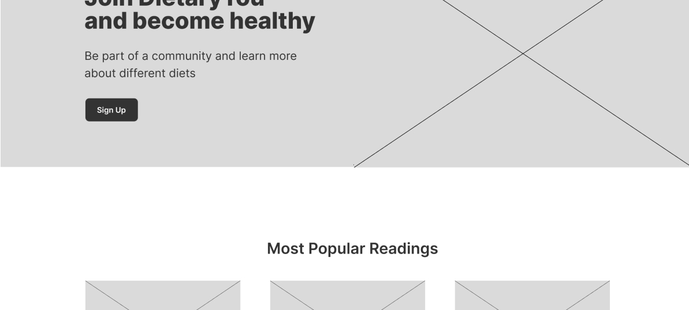

[Link to all wireframes](https://github.com/dev-timm/DietaryYou/tree/main/static/images/readme/wireframes)

### Usability

#### Layout
The interface is overall very minimalistic so that the user can focus completely on the core functionality. 

#### Colors
The colors are designed to highlight important actions such as links and submit buttons. Green was chosen as the primary color as it is a symbol for “fresh” and “healthy” and, therefore, a perfect fit to the product.

## Features

### Sign Up
By clicking on “Sign Up” in the navigation the visitor will be led to the registration page. Users are prompted to choose a username and password before signing up. They can also add an email address but this is optional. This was implemented through AllAuth in Django. If the user already has an account, they can find a link at the bottom which leads them to the sign in page.

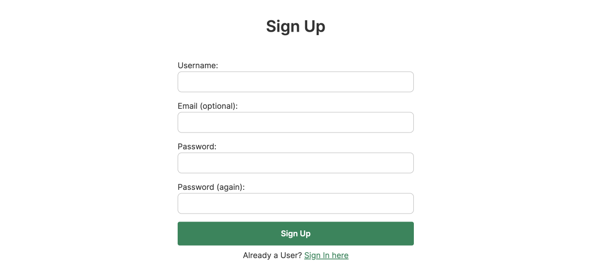

### Sign In
By clicking on “Sign In” in the navigation the user will be led to the log in page where they can enter their chosen username and password, as well as select the remember me checkbox. This was implemented through AllAuth in Django. If the user doesn’t have an account, they can find a link at the bottom which leads them to the sign up page.

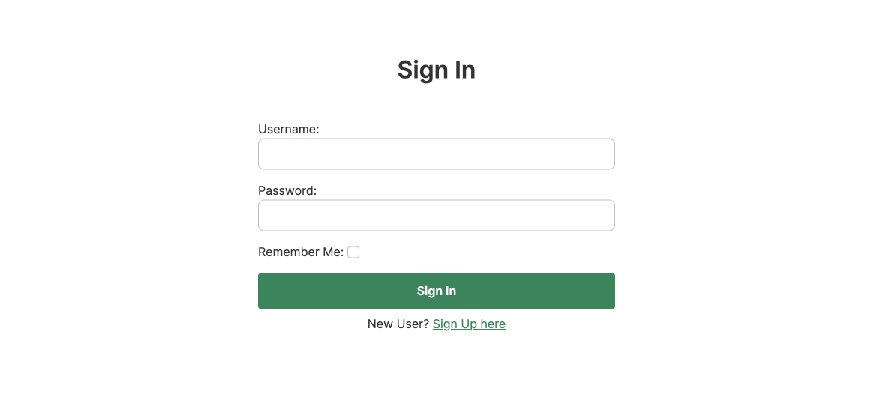

### Header
The header is always present at the top of the page. If the user is not logged in, the header shows a sign in and sign up link. If the user is signed in, however, the header displays a button for creating a new post and a link to the account section


### Footer
The footer is always visible and contains the copyright symbol as well as links to the 3 social media accounts.

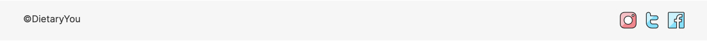

### Homepage
The homepage is the first page the user sees when visiting the website and logging in.

#### Hero
The hero section welcomes the user when visiting the page. It provides a short introduction with a button that leads to the sign up page.


#### Most Popular Posts
The most popular readings section contains 3 posts that have the highest amount of likes and therefore might be interesting to the users.

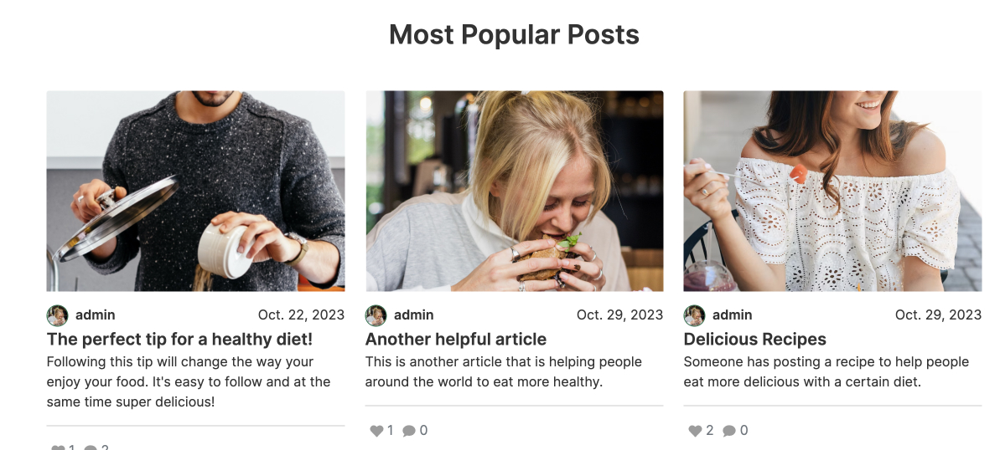

#### Latest Posts
This section shows 3 posts that were most recently published.

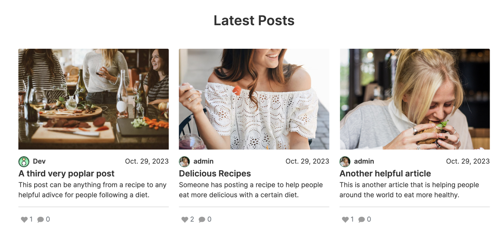

### Blog
The blog page is where users can view all published posts sorted by date.


#### CRUD: Create Post
By clicking on the “New Post” button in the header registered users can post an article, recipe or helpful tips to the blog. Required fields are Title, Slug and Content. The user can also add an image, the excerpt and decide if the post should be a draft or published directly. With the help of django-summernote the user can freely decide how to style their content and even add images if they like.

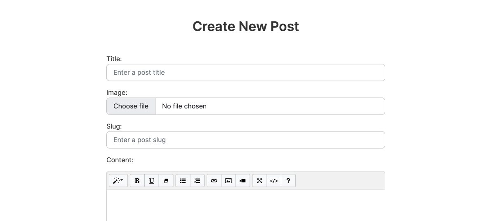

#### CRUD: Read Post
Both visitors and logged-in users can click on the post they find interesting and read it.

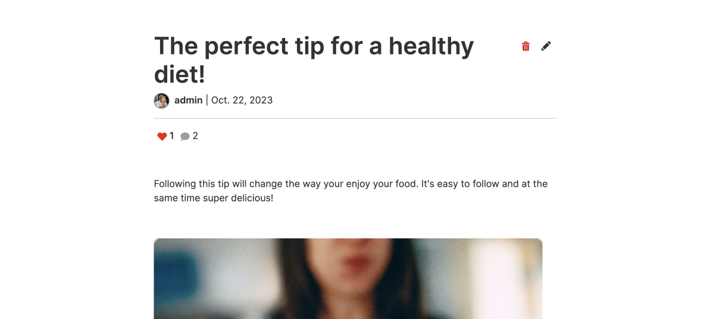

#### CRUD: Update Post
If a user is logged in and is the author of the post, they have the option to edit it at any point. To edit a post the user simply has to click on the edit icon next to the title.

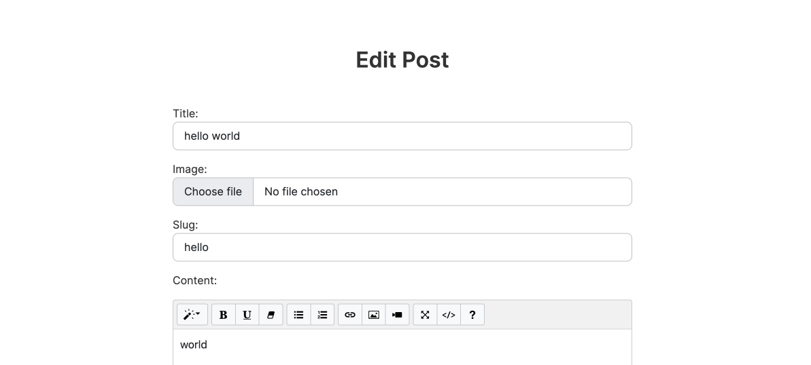

#### CRUD: Delete Post
If the author of a post decides that they want to remove it, they have the option to delete it. This action requires the user to be logged in. To delete a post the user has to click on the delete icon next to the title. The user will be warned before deleting the post.

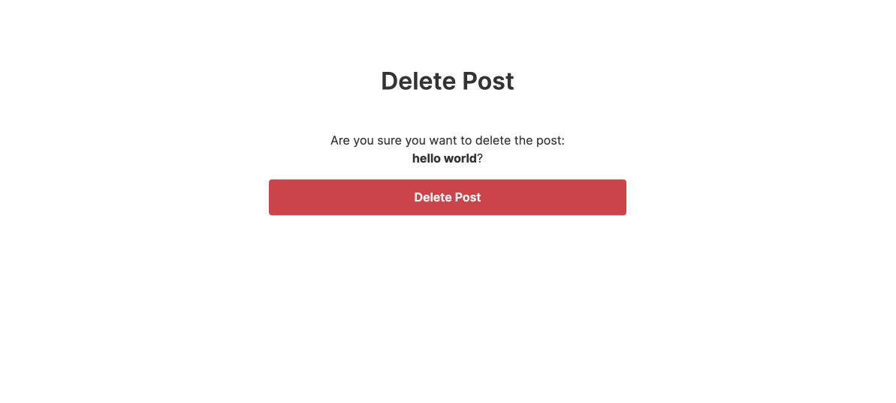

#### Comments & Likes
A comment section is under every blog post where users can post and read comments. Posting a comment requires the user to be signed in. The user can also reach the comment section by clicking on the comment icon on top of the post detail page. Once a comment has been submitted, users with admin permissions will review it and approve it for posting.

The user can also like a post or decide to remove the like e.g. if they clicked accidentally. Liking a post requires the user to be signed in.

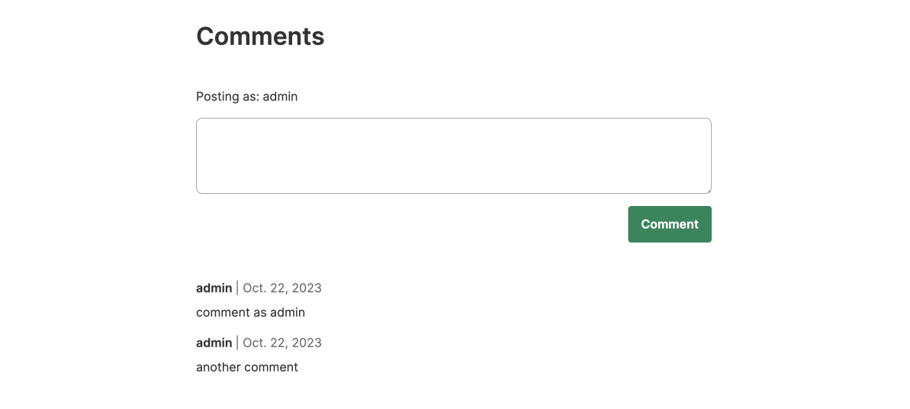

### Settings
By clicking on user profile picture in the top navigation the user lands on the account page. Here they can edit their email address, change their password and log out.

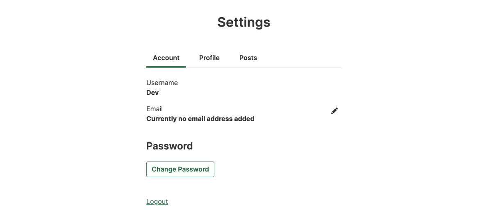

#### Email Settings
In the email settings users can add and delete email addresses. Users can also decide which of their email addresses should be the primary one but only if they are verified by an admin.

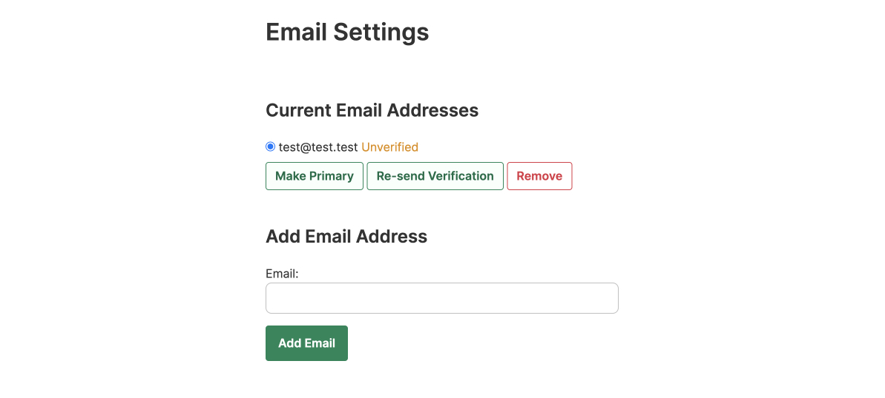

#### Change Password
The user can also change their password by typing in the current password followed by the new one, repeated twice. This is implemented through AllAuth.

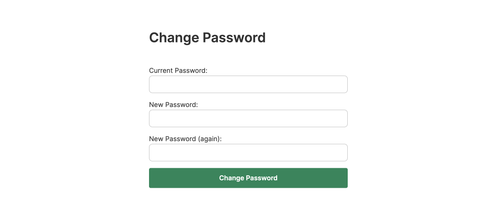

#### Logout
By clicking “Logout” in the account page the user gets prompted before they sign out. This feature was implemented through AllAuth.

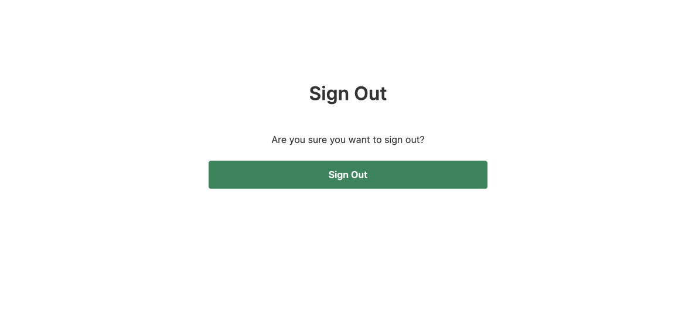

#### View Profile
Here the user can customize their profile which contains full name, bio, hobbies and location. By default all the fields are empty until they are edited for the first time.

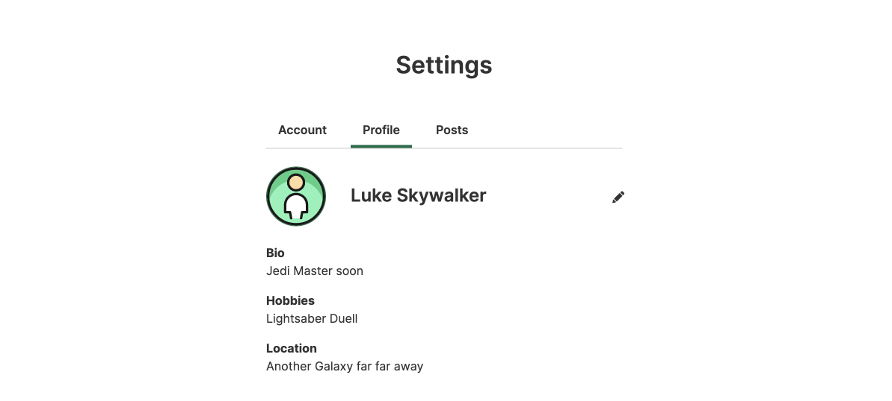

#### Update Profile
By clicking on the edit icon in the profile view the user can edit their profile.

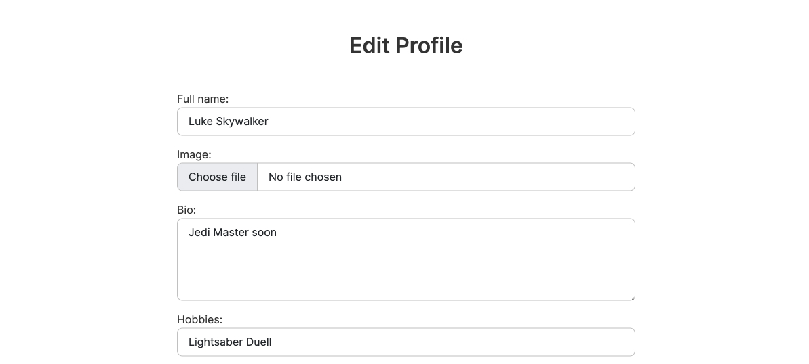

#### Drafts and Published Posts
Users can also see all the posts they have saved as drafts as well as already published.

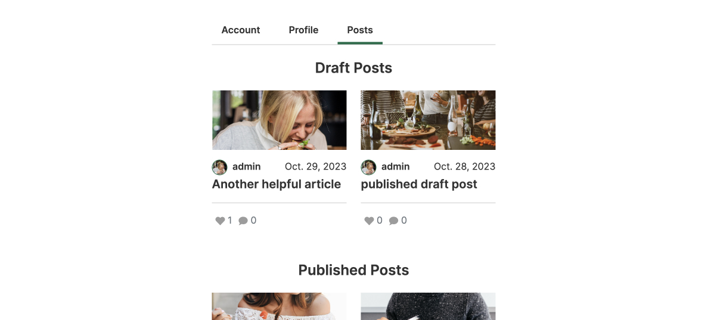

### 404
If the user reaches a non-existing page, a custom 404 page is displayed.

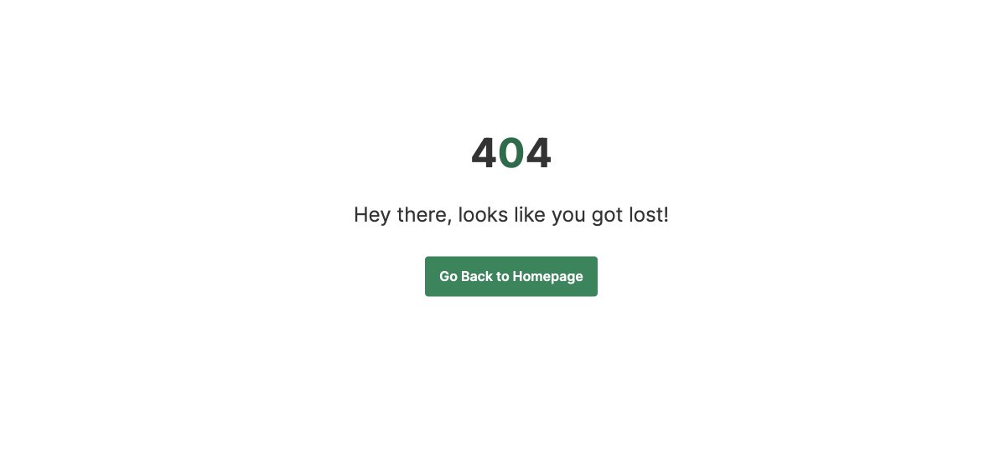

## Testing

### Validation
All webpages were tested with an [HTML Validator](https://validator.w3.org/), [CSS Validator](https://jigsaw.w3.org/css-validator/), [JS Validator](https://jshint.com/) and Code Institute’s own [Python Linter](https://pep8ci.herokuapp.com/) and no significant issues were found.

### Lighthouse
Each page of the deployed website has been tested multiple times with Google Chrome's Lighhouse feature to ensure all scores have been above 90 for both mobile and desktop devices.

### Tested Devices & Browsers
- iPhone 11
    - Safari
- Macbook Pro 2019 16-inch
    - Chrome
    - Safari
    - Firefox

### Feature Testing
| Feature | Action | Expected Behaviour | Pass/Fail
| --- | --- | --- | --- |
| Sign Up | Don’t enter username | Shows error message that field must be filled | Pass
| Sign Up | Enter new username | No error because username doesn’t exists yet | Pass
| Sign Up | Enter already existing username | Shows error message that username already exists | Pass
| Sign Up | Enter username with a space | Shows error message that username format has to be changed | Pass
| Sign Up | Enter no email address | Signing up works since email is optional | Pass
| Sign Up | Enter correct email address | Signing up works without error | Pass
| Sign Up | Enter email address that doesn’t follow common conventions | Shows error message that email format must follow conventions | Pass
| Sign Up | Enter and repeat acceptable password  | Signing up works without error | Pass
| Sign Up | Repeat wrong password  | Shows error message that passwords need to match | Pass
| Sign Up | Don’t enter password | Shows error message that field must be filled | Pass
| Sign Up | Enter too short password | Shows error message that password must at least be 8 characters | Pass
| Sign Up | Fill out all fields correctly and submit | Creates new account and user is signed in automatically | Pass
| Sign Up | Click sign in link below button | Leads user to sign in page | Pass
| Sign In | Click on the sign in button on the header | Opens sign in page | Pass
| Sign In | Enter no username or password | Shows error message that fields must be filled | Pass
| Sign In | Enter wrong username and/or password | Shows error message that either username or password are incorrect | Pass
| Sign In | Enter correct username and password and click submit button | Successfully logs user in | Pass
| Sign In | Click sign up link below button | Leads user to sign up page | Pass
| Homepage | Click on the Join Now button in hero section without being logged in | Leads to sign up page | Pass
| Homepage | Click on the Join Now button in hero section while being logged in | Refreshes page | Pass
| Homepage | Click on the button in popular or recent post section without being logged in | Leads to sign up page | Pass
| Homepage | Click on the button in popular or recent post section while being logged in | Refreshes page | Pass
| Homepage | Click an author’s name on one of the posts | Leads to the author’s public profile | Pass
| Homepage | Click on a post title | Leads to post detail page | Pass
| Blog | Click on a post title | Leads to post detail page | Pass
| Blog | Click the authors name on one of the posts | Leads to the authors user profile | Pass
| Post Detail | Click on like icon without being logged in | No changes made | Pass
| Post Detail | Click on like icon while being logged in | Icon changes color and counter increases/decreases by one | Pass
| Post Detail | Click on comment icon | Page scrolls down to the comment section | Pass
| Post Detail | Post a comment without entering content while being logged in | Shows error message that field must be filled | Pass
| Post Detail | Post a comment with entered content while being logged in | Show alert that comment is awaiting approval | Pass
| Create/Edit Post | Submit the post without filling in required fields | Show error message on first required field to please fill in | Pass
| Create/Edit Post | Submit the post with wrong format in at least one text fields | Shows error message that conventions must be followed | Pass
| Create/Edit Post | Submit the post with a slug that already exists | Shows error message that slug already exists | Pass
| Create/Edit Post | Submit the post with required fields Title, Slug and content filled in | Submits post successfully | Pass
| Create/Edit Post | Submit the post without choosing an image | Placeholder image will be added instead | Pass
| Create/Edit Post | Choose status “Draft” | Post is not published but saved under the account page | Pass
| Create/Edit Post | Choose status “Published” | Post is published | Pass
| Create/Edit Post | Click on edit icon on the post detail page | Opens edit page for this post | Pass
| Delete Post | Click on delete icon on the post detail page | Opens a warning page before user can delete the post | Pass
| Delete Post | Click on delete button on warning page | Deletes post | Pass
| Account | Click on profile image in the header | Opens account settings page | Pass
| Account | Click on edit icon on account settings page | Opens email settings | Pass
| Account | Click add email button without adding an email | Shows error message on first required field to please fill in | Pass
| Account | Add new email with incorrect format | Shows error message that email format must follow conventions | Pass
| Account | Add new email with correct format | Adds email with unverified status and shows info alert | Pass
| Account | Add second unverified email and set to primary | Shows error message that email needs to be verified | Pass
| Account | Add second verified email and set to primary | Changes primary email and shows success message | Pass
| Account | Delete primary email | Shows error message that primary email cannot be removed | Pass
| Account | Delete non-primary email | Removes email address and shows success message | Pass
| Account | Click change password button | Opens change password page | Pass
| Account | Submit the form without filling in required fields | Shows error message on first required field to please fill in | Pass
| Account | Enter wrong current password | Shows error message to please fill in current password | Pass
| Account | Enter and repeat new acceptable password  | Changing password works without error | Pass
| Account | Repeat wrong new password  | Shows error message that passwords need to match | Pass
| Account | Enter too short password | Shows error message that password must be at least 8 characters | Pass
| Account | Enter all passwords correctly | Shows success message that password is changed | Pass
| Account | Click on log out link | Opens a warning page before user can log out | Pass
| Account | Click on log out button on warning page | Logs out user and shows success message | Pass
| Profile | Click on edit icon next to the profile image | Opens edit profile page | Pass
| Profile | Save the profile without filling in required fields | Shows error message on first required field to please fill in | Pass
| Profile | Submit the profile with required fields | Submits profile successfully | Pass
| Profile | Submit the profile without choosing an image | Placeholder image is still displayed | Pass
| Profile | Choose a profile image and save the profile | New profile image is displayed | Pass
| Header | Click on logo or Home | User is sent to homepage | Pass
| Header | Click on Blog | User is sent to blog page with all posts | Pass
| Footer | Click on social media icons | User is sent to corresponding social media account | Pass

## Deployment

### Deploying the program to Heroku

1. Log into Heroku and make sure you are in the "Dashboard" section
2. Click on the top right button “New” and select “Create new app”
3. Enter app name and choose your region
4. Click on the “Create app” button
5. Go to “Settings” and add config vars (if necessary) and buildpacks
6. Go to “Deploy” section and connect to your GitHub account
7. Decide between automatic or manual deployment and click on the corresponding button
8. If the build is completed successfully, you should see a button to view the deployed application

### Cloning the repository

1. Visit the GitHub page of the website’s repository.
2. Click the “Code” button on top of the page.
3. Click on “HTTPS” below the “Clone” section.
4. Click on the copy button next to the link to copy it.
5. Open your IDE.
6. Type  ```git clone <copied URL>``` into the terminal.
7. If everything's done right, you should now see a cloned repository in your IDE.

## Credits

### Images
All images for the website are taken from [unsplash.com](https://unsplash.com/).

### Code

Solutions that helped me with:

- [changing width of summernote editor](https://stackoverflow.com/questions/61657061/how-do-i-resize-the-width-of-summernote)

- [positioning footer at the bottom](https://www.youtube.com/watch?v=J-r75L3Tflg&t=235s)

- understanding class based views for [creating](https://www.youtube.com/watch?v=m3efqF9abyg), [editing](https://www.youtube.com/watch?v=J7xaESAddDQ&list=PLCC34OHNcOtr025c1kHSPrnP18YPB-NFi&index=7), [deleting](https://www.youtube.com/watch?v=8NPOwmtupiI&list=PLCC34OHNcOtr025c1kHSPrnP18YPB-NFi&index=8) and [validating the right user](https://www.youtube.com/watch?v=Y1Us5jVT07E&list=PLCC34OHNcOtr025c1kHSPrnP18YPB-NFi&index=17) when working with blog posts

- [styling form components in forms.py](https://www.youtube.com/watch?v=6-XXvUENY_8)

- [styling AllAuth form components in forms.py](https://stackoverflow.com/questions/21368481/django-allauth-how-to-add-custom-css-class-to-fields)

- [automatically setting the logged in user as author of new post](https://www.reddit.com/r/djangolearning/comments/l7nuah/how_to_automatically_add_the_logged_in_users/) 

- [adding the success message to the delete view](https://stackoverflow.com/questions/24822509/success-message-in-deleteview-not-shown)

- [counting the number of comments](https://www.reddit.com/r/django/comments/ka6mou/comment/gf8vhih/)

- [creating the user profile as soon as the user signs up](https://stackoverflow.com/questions/66745216/django-creating-model-instance-when-user-is-created)