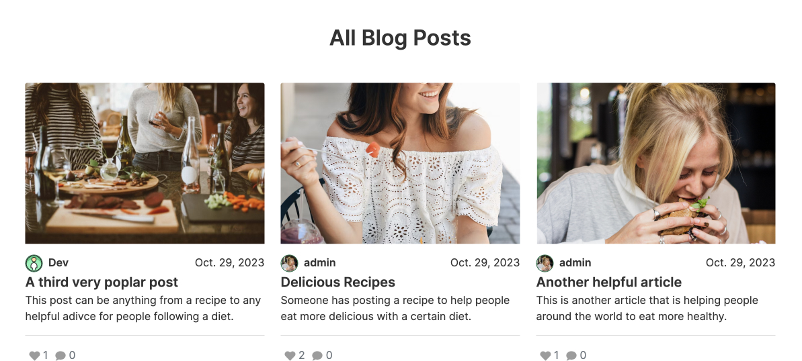

# DietaryYou

Having different food problems can often make it hard to find inspiration and ideas for cooking new dishes. DietaryYou was built to support people with dietary needs by creating a community that supports each other through writing articles, sharing recipes and exchanging knowledge in the comments.

[Link to the project](https://dietary-you-4150ad10a5a5.herokuapp.com/)

## Product Decisions 

### User Needs
As a user I want to...
- ...have a large offer of different recipes that fit my dietary plan so that I’m not bored of eating the same things over and over again.
- ...know what others say about their experience with different diets so that I can understand what works well and what doesn’t.
- ...share my experience and knowledge about diets so that I can help others to live a more healthy life. 
- ...see the most popular and recent articles so that I can easily find interesting topics to read.

### MVP
The MVP is a simple blog that aims to build a community of users with dietary issues so that people can support each other with tips and recipes. Therefore, the MVP provides users with the ability to create, read, edit and delete posts (CRUD). Moreover, users have the possibility to like and comment on posts which should welcome a healthy conversation to further discuss the topics mentioned in the post.

To create, edit and delete a post the user needs to register and be logged in. For the MVP they also have the ability to customize their public profiles by adding more information about themselves as well as adding a profile picture.

## Design Decisions

### Wireframes
Before starting with the development it was crucial to first sketch out the functionality in the form of a low-fi wireframes. After those were done and the functionality was clear, they were turned into hi-fi prototypes.

[Link to all wireframes](https://github.com/dev-timm/DietaryYou/tree/main/static/images/readme/wireframes)

### Usability

#### Layout
The interface is overall very minimalistic so that the user can focus completely on the core functionality. 

#### Colors
The colors are designed to highlight important actions such as links and submit buttons. Green was chosen as the primary color as it is a symbol for “fresh” and “healthy” and, therefore, a perfect fit to the product.

## Features

### Sign Up
By clicking on “Sign Up” in the navigation the visitor will be led to the registration page. Users are prompted to choose a username and password before signing up. They can also add an email address but this is optional. This was implemented through AllAuth in Django. If the user already has an account, they can find a link at the bottom which leads them to the sign in page.

### Sign In
By clicking on “Sign In” in the navigation the user will be led to the log in page where they can enter their chosen username and password, as well as select the remember me checkbox. This was implemented through AllAuth in Django. If the user doesn’t have an account, they can find a link at the bottom which leads them to the sign up page.

### Header
The header is always present at the top of the page. If the user is not logged in, the header shows a sign in and sign up link. If the user is signed in, however, the header displays a button for creating a new post and a link to the account section

### Footer
The footer is always visible and contains the copyright symbol as well as links to the 3 social media accounts.

### Homepage
The homepage is the first page the user sees when visiting the website and logging in.

#### Hero
The hero section welcomes the user when visiting the page. It provides a short introduction with a button that leads to the sign up page.

#### Most Popular Posts
The most popular readings section contains 3 posts that have the highest amount of likes and therefore might be interesting to the users.

#### Latest Posts
This section shows 3 posts that were most recently published.

### Blog
The blog page is where users can view all published posts sorted by date.

#### CRUD: Create Post
By clicking on the “New Post” button in the header registered users can post an article, recipe or helpful tips to the blog. Required fields are Title, Slug and Content. The user can also add an image, the excerpt and decide if the post should be a draft or published directly. With the help of django-summernote the user can freely decide how to style their content and even add images if they like.

#### CRUD: Read Post
Both visitors and logged-in users can click on the post they find interesting and read it.

#### CRUD: Update Post
If a user is logged in and is the author of the post, they have the option to edit it at any point. To edit a post the user simply has to click on the edit icon next to the title.

#### CRUD: Delete Post
If the author of a post decides that they want to remove it, they have the option to delete it. This action requires the user to be logged in. To delete a post the user has to click on the delete icon next to the title. The user will be warned before deleting the post.

#### Comments & Likes
A comment section is under every blog post where users can post and read comments. Posting a comment requires the user to be signed in. The user can also reach the comment section by clicking on the comment icon on top of the post detail page. Once a comment has been submitted, users with admin permissions will review it and approve it for posting.

The user can also like a post or decide to remove the like e.g. if they clicked accidentally. Liking a post requires the user to be signed in.

### Settings
By clicking on user profile picture in the top navigation the user lands on the account page. Here they can edit their email address, change their password and log out.

#### Email Settings
In the email settings users can add and delete email addresses. Users can also decide which of their email addresses should be the primary one but only if they are verified by an admin.

#### Change Password
The user can also change their password by typing in the current password followed by the new one, repeated twice. This is implemented through AllAuth.

#### Logout
By clicking “Logout” in the account page the user gets prompted before they sign out. This feature was implemented through AllAuth.

#### View Profile
Here the user can customize their profile which contains full name, bio, hobbies and location. By default all the fields are empty until they are edited for the first time.

#### Update Profile
By clicking on the edit icon in the profile view the user can edit their profile.

#### Drafts and Published Posts
Users can also see all the posts they have saved as drafts as well as already published.

### 404
If the user reaches a non-existing page, a custom 404 page is displayed.

